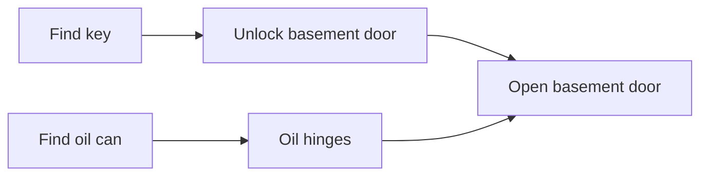
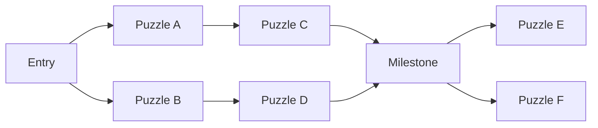

# Puzzle Dependency Charts

Working notes distilled from:

- Ron Gilbert, "Puzzle Dependency Charts" (Grumpy Gamer, 2014): https://grumpygamer.com/puzzle_dependency_charts/
- Joshua Weinberg, "Puzzle Dependency Graph Primer" (Game Developer, 2016): https://www.gamedeveloper.com/design/puzzle-dependency-graph-primer

These notes are paraphrased reference material plus implementation memo. The source
articles and images are copyrighted; use them as references, not as assets to copy
into the project.

## Core Idea

A Puzzle Dependency Chart, also called a Puzzle Dependency Graph, is a directed
graph for designing puzzle structure. It shows what must be solved before what,
and therefore exposes the player's available choices, bottlenecks, dead ends, and
narrative assumptions.

It is not primarily a walkthrough. A flowchart is useful when explaining how to
solve a game; a dependency chart is useful when designing one.

The chart answers questions like:

- What can the player work on right now?
- What does this puzzle unlock?
- What does this puzzle require?
- Where does the game become too linear?
- Where does the game become too broad and hard to author?
- Which story events are guaranteed to have happened before this puzzle?
- Are there circular locks, impossible states, or unintended bottlenecks?

## Terms

- **Node**: A puzzle, puzzle step, gate, action, or meaningful solvable task. A
  node should usually be something the player can do, not merely something the
  story says. Story beats can be nodes only when they are required by puzzle
  logic.
- **Edge**: A dependency from one node to another. If `A -> B`, then `B` cannot
  be solved until `A` is solved.
- **Dependency token**: The thing carried by an edge: an inventory item, access
  to a room, a changed NPC state, a learned fact, a repaired machine, permission,
  a global flag, or any other condition needed by a later puzzle.
- **Root node**: A node with no prerequisites. It is available at the beginning
  of the relevant chart, act, area, or scenario.
- **Leaf node**: A node with no downstream puzzle depending on it. Leaves are
  often act endings, rewards, optional content, or suspicious loose ends.
- **In-degree**: Number of prerequisites a node has. High in-degree means the
  node gathers branches together.
- **Out-degree**: Number of later nodes unlocked by a node. High out-degree means
  the node opens new possibilities.
- **DAG**: A directed acyclic graph. Puzzle dependency charts should normally be
  DAGs. A cycle means the game requires something that can only be obtained after
  the thing it unlocks.
- **Topological order**: One valid order in which the player could solve all
  nodes while satisfying dependencies. Most non-trivial charts have many valid
  orders.
- **Ancestor set**: All upstream nodes that must be complete before a given node.
  This is the safe set of story facts the designer can assume at that moment.
- **Descendant set**: All downstream nodes made possible, directly or indirectly,
  by a given node.

## Minimal Example

Opening a stuck basement door might require two independent preparations:



The important point is that `Unlock basement door` does not depend on
`Oil hinges`, and `Oil hinges` does not depend on `Unlock basement door`. They
are parallel work. Both feed into `Open basement door`.

This is dependency, not flow. The player may bounce between attempts, rooms, and
ideas in messy human order, but the chart records only the logical prerequisites.

## Why Designers Use These Charts

Ron Gilbert describes Puzzle Dependency Charts as one of the central tools for
adventure game design, especially once Lucasfilm adventure games moved beyond
linear or dead-end-heavy structures. The technique matured through designers
including Gilbert, David Fox, and Noah Falstein, and Gilbert relied on it heavily
for the puzzle design of Monkey Island-era adventures. Weinberg's primer frames
the same technique in graph-theory terms and extends it with analysis methods.

The practical value is visibility:

- A designer can see where the player has only one thing to do.
- A designer can see where the player has too many unrelated things to do.
- A designer can see where solving one puzzle opens a healthy set of follow-up
  options.
- A designer can intentionally collapse branches into act endings or major
  milestones.
- A designer can identify whether a narrative line assumes the player has done
  something that is not actually guaranteed.

## Good Shape: Expansion And Contraction

A healthy adventure puzzle structure often looks like repeating diamonds:



Common pattern:

1. The player enters a space with a simple immediate goal.
2. Solving that goal opens two or three new puzzle threads.
3. Those threads proceed at different rates.
4. Several threads collapse into one larger solution or act gate.
5. The gate opens the next set of threads.

Too much linearity makes the game brittle: one stuck puzzle can halt everything.
Too much openness can make the game feel diffuse, hard to pace, and hard to
write around. The chart helps tune between those extremes.

## Acts And Bottlenecks

Gilbert likes designing adventures in acts. Each act can end in a bottleneck that
all relevant puzzle threads must pass through before the next act opens.

Useful reasons to have act bottlenecks:

- They give the player a sense of completion.
- They let the designer retire old knowledge, locations, or inventory.
- They make narrative pacing easier because the designer can re-synchronize what
  every player has done.
- They make the next act easier to reason about.

Risk:

- Too many bottlenecks make the game feel linear.
- A bottleneck with only one available prerequisite path can become a hard stop.
- A bottleneck should usually be preceded by enough open work that stuck players
  can change focus.

## Design Backwards

A practical charting method is to work backwards from the end of a puzzle chain:

1. Start with a goal, such as "open the basement door" or "board the ship".
2. Ask what must be true for that goal to happen.
3. Add those required nodes.
4. For each new node, ask what must be true before it can happen.
5. Stop when the prerequisites are available at the beginning of the act,
   location, or scenario.

This avoids hiding a key or placing an object before knowing why it matters. It
also keeps the chart centered on player-useful dependencies rather than arbitrary
content.

## Graph Layout

Two layout traditions show up in the sources:

- Gilbert often works left-to-right, partly because it is practical for wall-size
  design boards.
- Weinberg recommends top-down hierarchical layout for analysis and comparison.

For an analysis tool, hierarchical layout is especially useful:

- Place earlier nodes above later nodes, or left of later nodes depending on
  orientation.
- Draw edges in one direction only.
- Put each node in the earliest/highest layer that does not violate dependencies.
- Root nodes sit in the first layer.
- A layer's width approximates how many puzzles may be open at that stage.

This stable layout makes different games, acts, or revisions comparable.

## Non-Linear Branching

Non-linear branching means more than one puzzle is available to solve at the same
time. This is about puzzle order, not branching story endings.

Benefits:

- Players can switch tasks when stuck.
- The game feels less like a single locked corridor.
- The designer can support discovery, revisiting, and inventory experimentation.

Costs:

- The number of valid solve orders grows very fast.
- Dialogue and descriptions cannot assume much unless dependencies guarantee it.
- Testing becomes harder because there are many possible states.
- UI, hinting, quest logs, and state tracking must handle partial progress.

The combinatorial risk is severe. Three independent open puzzles allow six
orders. Four allow twenty-four. Five allow one hundred twenty. A layer with
thirteen independent puzzles has more than six billion possible orders.

Design takeaway: wide layers create freedom, but also create authoring and QA
debt. Use them deliberately.

## Narrative Safety

The dependency graph tells the writer what the player must already know.

For any node `N`, compute its ancestor set: every upstream node that must be
solved before `N`. Only events in that ancestor set are guaranteed to have
happened. A line of dialogue, barks, object descriptions, or cutscene around `N`
can safely reference only those guaranteed facts, plus always-known world facts.

If two puzzle branches are disconnected upstream, a puzzle in one branch should
not casually mention events from the other branch. Some players may not have done
that other branch yet.

Implementation memo:

- A good tool should expose "safe narrative context" for the selected node.
- It should also expose "unsafe references" if authored text is tagged with the
  node/event it refers to.
- Act bottlenecks can intentionally re-synchronize narrative state.

## Degree-Based Reading

Degree metrics help identify a node's design role:

- High out-degree, low in-degree: opener. It gives the player more to do.
- Low out-degree, high in-degree: closer. It resolves parallel branches.
- High in-degree and high out-degree: major transformation or act hinge.
- Zero in-degree: starting availability.
- Zero out-degree: ending, reward, optional branch, or possible dangling puzzle.
- Long chain of single in/single out nodes: linear segment.

None of these are automatically good or bad. The value is in seeing whether the
shape matches the intended pacing.

## Validity Checks

A dependency chart should be checked for:

- **Cycles**: impossible circular locks.
- **Disconnected islands**: content not reachable from the intended start or not
  connected to the intended goal.
- **Unintended leaves**: puzzles that do not unlock anything and do not count as
  optional rewards or endings.
- **Unintended roots**: puzzles available too early.
- **Single-path bottlenecks**: places where one unsolved puzzle stops all
  progress.
- **Overwide layers**: too many independent open puzzles at once.
- **Underwide spans**: long stretches where the player has only one available
  action.
- **Resource ambiguity**: edge label says "key", but there are multiple keys or
  unclear ownership.
- **Narrative assumption leaks**: text in one branch referring to facts from
  another unsolved branch.
- **Dead ends**: states where the player can consume, lose, or miss a dependency
  needed later.

Classic adventure design warning: dead ends and uneven bottlenecks are often
symptoms of designing puzzle chains without a dependency view.

## Business-Process Views

Weinberg suggests borrowing tools from business process analysis, treating each
puzzle as a task and dependencies as process constraints.

Useful alternate views:

- **Gantt-style availability chart**: rows are puzzles, columns are dependency
  layers or time-like sequence steps. A column with many available puzzles shows
  high branching. A long diagonal line shows linearity.
- **Dependency Structure Matrix (DSM)**: same nodes on both axes; marks indicate
  dependencies. When nodes are topologically ordered, dependency marks should not
  appear above the diagonal. Marks above the diagonal imply a cycle or invalid
  ordering. Dense vertical/horizontal patterns show hubs and branch clusters.
- **Monte Carlo simulation**: assign each puzzle an estimated time or difficulty
  range, sample many possible playthroughs, and compare total effort
  distributions between graph revisions.

Caveat: production-task tools often assume parallel workers, while a single
player acts serially. Still, players mentally work on multiple puzzles in
parallel, so time/difficulty ranges can still be useful as approximations.

## Tooling Notes From The Sources

Referenced tools:

- **OmniGraffle**: Gilbert's preferred modern visual tool for this purpose on
  macOS.
- **Graphviz / DOT**: useful for text-described graphs and automatic layout;
  Gilbert used Graphviz for DeathSpank.
- **yEd**: Weinberg strongly recommends it for hierarchical layout, grouping,
  swim lanes, and edge routing.
- **Tulip**: supports graph algorithms and programmable manipulation.
- **Cambridge Advanced Modeler (CAM)**: used by Weinberg for business-process
  analysis views such as Gantt charts, DSMs, and simulation.

Important workflow point: use software that automatically reflows the graph when
nodes and edges change. Manual box-shuffling gets in the way of design thinking.

## Data Model For A Tool Like DepDoodle

Potential entities:

```text
PuzzleNode
  id
  title
  description
  act / chapter / area
  node_type: puzzle | step | gate | reward | story_gate | optional
  difficulty_estimate
  time_estimate_min
  time_estimate_max
  tags
  notes

DependencyEdge
  from_node_id
  to_node_id
  token_label
  token_type: item | access | fact | npc_state | world_state | ability | other
  consumes_token: boolean
  optional: boolean
  notes

StoryFact
  id
  title
  revealed_by_node_id

TextReference
  id
  attached_to_node_id
  refers_to_story_fact_id
```

Derived data:

- In-degree and out-degree.
- Topological layers.
- Ancestor and descendant sets.
- Available node sets after each layer.
- Branching width by layer.
- Bottleneck nodes.
- Estimated solve-order count or sampled solve-order count.
- Cycle and reachability reports.
- Narrative safety warnings.
- Resource lifetime: where a token is produced, used, consumed, or retired.

## Useful Algorithms

- **Cycle detection**: reject or warn on cycles unless deliberately modeling
  reusable loops outside the dependency graph.
- **Topological sort**: produce one valid solve order; also useful for matrix
  ordering.
- **Layer assignment**: `layer(node) = 0` for roots, otherwise
  `1 + max(layer(parent))`.
- **Available-set scan**: at each stage, compute nodes whose parents are all
  solved and that are not yet solved.
- **Ancestor closure**: reverse graph traversal from a node.
- **Descendant closure**: forward graph traversal from a node.
- **Bottleneck detection**: find nodes or cut sets that many paths must pass
  through.
- **Width analysis**: count available nodes per layer and flag thresholds.
- **Narrative safety check**: for every text reference attached to node `N`,
  verify the referenced fact is revealed by an ancestor of `N` or by `N` itself.
- **Monte Carlo playthrough sampling**: repeatedly choose among available nodes,
  sample each node's effort range, and record completion totals.

## UI Ideas Worth Keeping

- Let designers create charts by working backwards from a goal.
- Support both left-to-right design view and top-down analysis view.
- Keep dependency labels visible; unlabeled edges hide design meaning.
- Provide act bands or swim lanes.
- Show branch width as a small histogram.
- Highlight nodes by degree delta: openers, closers, hinges, leaves, roots.
- Provide a selected-node inspector with:
  - prerequisites
  - produced tokens
  - unlocked downstream puzzles
  - guaranteed story facts
  - unsafe narrative references
  - estimated difficulty/time
- Include warnings for cycles, orphans, unexpected leaves, and overwide layers.
- Add a matrix view for dense graphs.
- Add a Gantt/availability view for pacing.
- Allow notes on why a bottleneck exists, especially act-ending bottlenecks.
- Export/import DOT for Graphviz interoperability.

## Design Heuristics

- Prefer puzzle nodes that describe player actions.
- Use edges for requirements, not chronological scene order.
- Label edges with the actual dependency token or condition.
- Avoid nodes that are only vague goals unless they are useful as act gates.
- A puzzle that unlocks two or three new options often feels good.
- A puzzle that unlocks nothing should be intentional.
- A puzzle that requires many unrelated prerequisites is a narrative or pacing
  hinge; treat it with care.
- Use bottlenecks sparingly and deliberately.
- Before writing branch-specific dialogue, inspect the branch's ancestors.
- If the graph is too linear, add parallel prerequisites or alternate routes.
- If the graph is too broad, add grouping, act gates, or dependencies that create
  smaller diamonds.
- If testing becomes impossible, the graph may be too open or the state model may
  need better tooling.

## Open Questions For Our Next Task

- Is DepDoodle a designer-facing editor, an analyzer, or both?
- Should its native model be puzzle-first, token-first, or hybrid?
- Do we want strict DAG enforcement or soft warnings?
- Should act bottlenecks be first-class objects?
- Should story facts and narrative safety be built in from the start?
- Should the app include Graphviz/DOT export as an early feature?
- Should we optimize for adventure games specifically, or keep the model general
  enough for RPG quests, metroidvania ability gates, crafting chains, and escape
  rooms?

