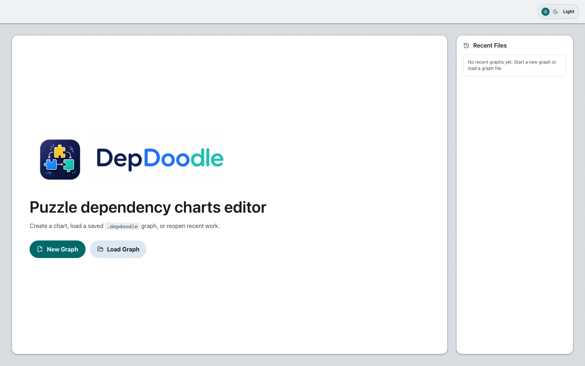
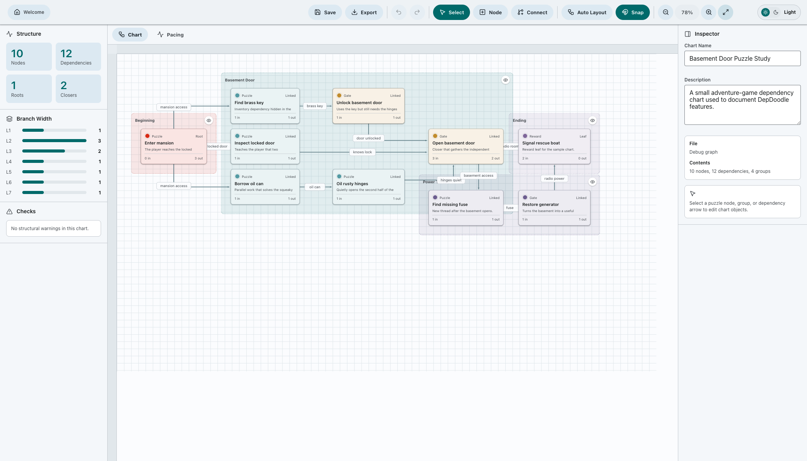
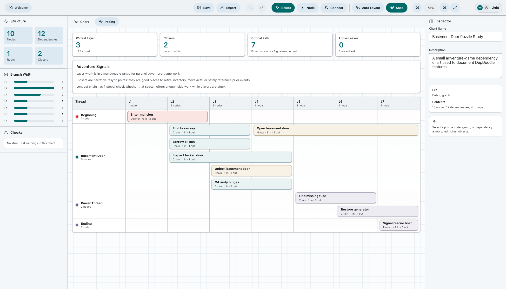

# DepDoodle

<p align="center">
  
</p>

DepDoodle is a Tauri desktop editor for puzzle dependency charts. It is built
for adventure-game puzzle design: showing what must be solved before what,
where branches open, where they collapse, what the player can work on at once,
and which narrative assumptions are safe.

The app aims for an OmniGraffle-like charting surface, but with puzzle-chart
semantics built in: dependency tokens, puzzle/gate/reward nodes, structural
checks, visible groups, Graphviz-assisted routing, and a pacing view generated
from the dependency graph.

## Screenshots

### Welcome



### Chart Editor



### Pacing View



The screenshots use a small sample chart created only for documentation. The
sample graph is not bundled as an app project.

## What It Edits

A puzzle dependency chart is a directed graph:

- A node is a puzzle, gate, reward, action, or meaningful task.
- An edge is a dependency: if `A -> B`, then `B` requires `A`.
- An edge label is the dependency token: an item, access, fact, state change, or
  permission.
- Roots are immediately available puzzle work.
- Leaves are endpoints, rewards, optional loose ends, or suspicious dangling
  puzzle work.
- Bottlenecks or closers are places where multiple branches collapse.
- A healthy adventure chart often expands into parallel work and contracts into
  milestones.

The longer design memo lives in
[PUZZLE_DEPENDENCY_CHART.md](PUZZLE_DEPENDENCY_CHART.md).

## Core Features

- **Welcome screen**: create a new graph, load a `.depdoodle` file, or reopen a
  recent graph.
- **Visible file metadata**: edit the chart name and description from the
  inspector when nothing is selected.
- **Puzzle nodes**: create and edit puzzle, gate, and reward nodes.
- **Node details**: title, memo, optional difficulty, kind, color, incoming
  count, outgoing count, role, prerequisites, unlocks, and safe narrative
  context.
- **Dependency arrows**: connect nodes with directed arrows and label each edge
  with a dependency token.
- **Token types**: item, access, fact, state, and permission.
- **Groups**: create visible groups from selected nodes, name them, color them,
  drag them, hide/show them, ungroup them, or delete their contents with
  confirmation.
- **Pacing tab**: a Gantt-like availability view generated from dependency
  layers, with groups as lanes.
- **Structural checks**: cycles, missing roots, non-reward leaves, over-wide
  layers, missing closers, and routing errors.
- **Branch width chart**: quick view of how many nodes sit in each dependency
  layer.
- **Auto Layout**: Graphviz-backed layout by dependency layer, with a
  confirmation prompt before rearranging nodes.
- **Routing**: Graphviz-assisted orthogonal path routing, with manual connector
  and label adjustments when needed.
- **Zoom controls**: zoom in, zoom out, reset, and fit chart to view.
- **Snap to grid**: optional grid snapping for node and group movement.
- **Multiple selection**: box-select or modifier-select nodes, then drag or
  group them.
- **Undo/redo**: multi-step history for graph edits.
- **Themes**: light and dark mode.
- **Save**: writes a `.depdoodle` project file.
- **Export**: PNG, JPG, PDF, and SVG.

## Main Views

### Welcome

The welcome screen is the project entry point. It shows the product logo,
creates new graphs, loads existing `.depdoodle` files, and lists recent files.
Recent items can be removed individually or cleared as a group.

Recent files are a convenience stored in local browser/app storage. They are not
the source of truth. Save important work as a `.depdoodle` file.

### Chart

The Chart tab is the editable dependency canvas. It contains:

- left analysis sidebar
- central graph canvas
- right inspector
- toolbar for save, export, undo, redo, tools, layout, snap, zoom, fit, and
  theme

Use **Node** to place puzzle nodes. Use **Connect** to click one node and then
another, creating a dependency. Use **Select** to move nodes, select groups, drag
routes, or edit labels.

### Pacing

The Pacing tab turns the dependency graph into an availability timeline:

- columns are topological dependency layers
- lanes are visible groups
- bars show when puzzle work becomes available and how far it influences later
  work
- closers, critical path length, loose leaves, and broad layers are summarized

This is deliberately not a calendar Gantt chart. It does not guess real time or
task duration. It is a puzzle-availability chart: useful for spotting linear
stretches, over-broad layers, act gates, and pacing pressure.

## Inspector Behavior

The inspector edits whatever is selected:

- **Nothing selected**: chart name, chart description, file name, and contents.
- **One node selected**: node semantics and relationships.
- **Multiple nodes selected**: selection summary, create group, or delete nodes.
- **Group selected**: group name, color, visibility, ungroup, or delete group
  contents.
- **Edge selected**: dependency token label, token type, route reset, label
  reset, or delete edge.

This is intentional: semantic data should be visible and editable. The app
should not rely on hidden chart meaning.

## File Format

DepDoodle projects use the `.depdoodle` extension. The contents are versioned
JSON so they are easy to inspect, diff, recover, and transform.

Current format:

```json
{
  "format": "depdoodle.graph",
  "version": 1,
  "title": "Basement Door Puzzle Study",
  "description": "Optional visible project notes.",
  "world": {
    "width": 1500,
    "height": 900
  },
  "nodes": [],
  "edges": [],
  "groups": []
}
```

### Node Fields

Each node stores:

- `id`
- `title`
- `note`
- `kind`: `puzzle`, `gate`, or `reward`
- `color`
- optional `difficulty`
- `x`, `y`, `width`, `height`

### Edge Fields

Each dependency edge stores:

- `id`
- `from`
- `to`
- `label`
- `tokenType`: `item`, `access`, `fact`, `state`, or `permission`
- optional `manualRoute`
- optional `manualLabelPosition`

### Group Fields

Each visible group stores:

- `id`
- `name`
- `color`
- `nodeIds`
- `hidden`

Groups are the only semantic lane/thread system used by the Pacing tab. If a
node is not in a group, it appears in an **Ungrouped** lane.

### Legacy Data

Older project files may contain a hidden node field called `act`. The current
app does not use hidden `act` data. On load, legacy `act` values are converted
into visible groups. A legacy `Beginning / Ending` act is split into separate
`Beginning` and `Ending` groups.

When saved again, the project uses visible groups and no hidden `act` fields.

## Export

DepDoodle can export the visible chart as:

- PNG
- JPG
- PDF
- SVG

Raster exports use a higher internal scale for better quality. SVG export is the
best choice when the chart needs to stay editable or scale cleanly in other
tools.

## Architecture

DepDoodle is intentionally small:

- **Tauri 2** for the desktop shell.
- **Vite** for frontend development.
- **TypeScript** for app logic.
- **Vanilla DOM/CSS** for the UI.
- **Graphviz WASM** via `@hpcc-js/wasm-graphviz` for graph layout and routing.
- **Lucide** for toolbar and UI icons.

Important paths:

- [src/main.ts](src/main.ts): app state, graph editing, rendering, routing,
  import/export, analysis, and inspector logic.
- [src/styles.css](src/styles.css): Material-style UI, canvas, nodes, groups,
  edges, welcome screen, and pacing view.
- [src-tauri](src-tauri): Tauri desktop configuration and Rust shell.
- [public/depdoodle-logo.png](public/depdoodle-logo.png): product logo.
- [docs/screenshots](docs/screenshots): README screenshots.
- [PUZZLE_DEPENDENCY_CHART.md](PUZZLE_DEPENDENCY_CHART.md): puzzle dependency
  chart design memo.

## Releases

Release builds are published on GitHub for Windows, macOS, and Linux.

The macOS builds are ad-hoc signed but not notarized. On first launch, macOS may
block the app until it is allowed from **System Settings > Privacy & Security**.

## Development

Install dependencies:

```bash
npm install
```

Run the desktop app:

```bash
npm run tauri dev
```

Run the browser-only frontend:

```bash
npm run dev
```

Build the frontend:

```bash
npm run build
```

Create a production Tauri build:

```bash
npm run tauri build
```

## Design Principles

- Prefer visible semantics over hidden metadata.
- Keep graph data recoverable and human-readable.
- Use groups for lanes, acts, characters, locations, chapters, or puzzle
  threads.
- Let Graphviz handle graph layout and path routing where possible.
- Keep manual layout overrides explicit and saved.
- Treat the dependency chart as design structure, not a walkthrough.
- Use analysis to reveal risks, not to dictate one correct design.

## Current Limitations

- There is no true autosave yet. Save explicitly to a `.depdoodle` file.
- The app does not currently import GraphML directly from the UI.
- Pacing bars are generated from dependency layers, not real time estimates.
- Narrative reference checking is not implemented yet; the selected-node safe
  context is based on graph ancestors only.
- The file format is versioned but still early.

## License

DepDoodle is licensed under the GNU General Public License v3.0. See
[LICENSE](LICENSE).

## Reference Material

The project is based on the puzzle dependency chart workflow described by Ron
Gilbert and expanded through graph-analysis language by Joshua Weinberg. See the
local memo for project-specific notes:

[PUZZLE_DEPENDENCY_CHART.md](PUZZLE_DEPENDENCY_CHART.md)
